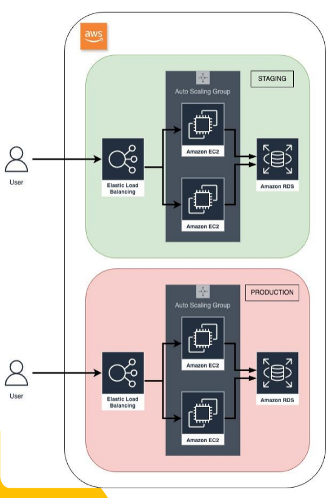
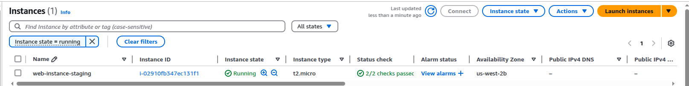
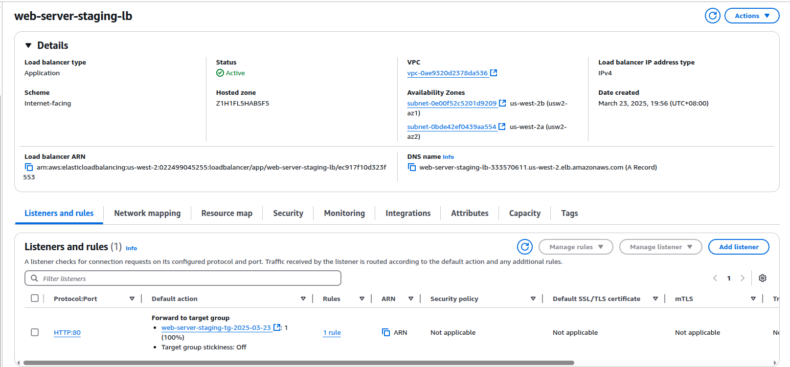
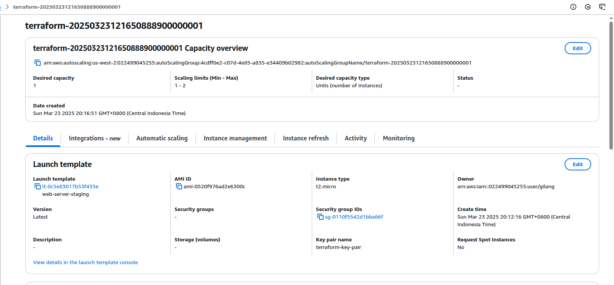
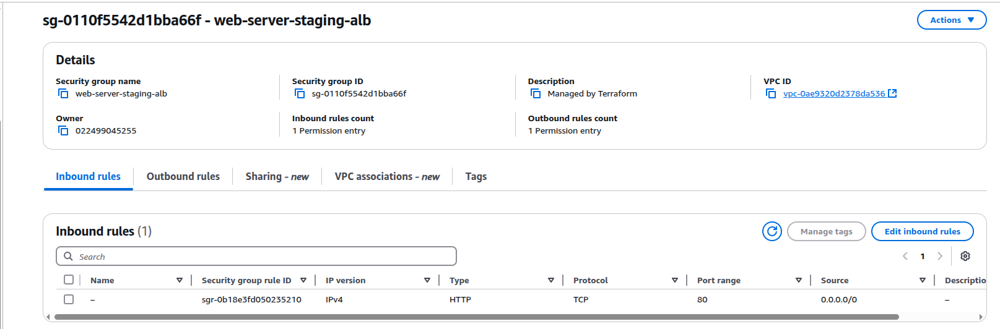
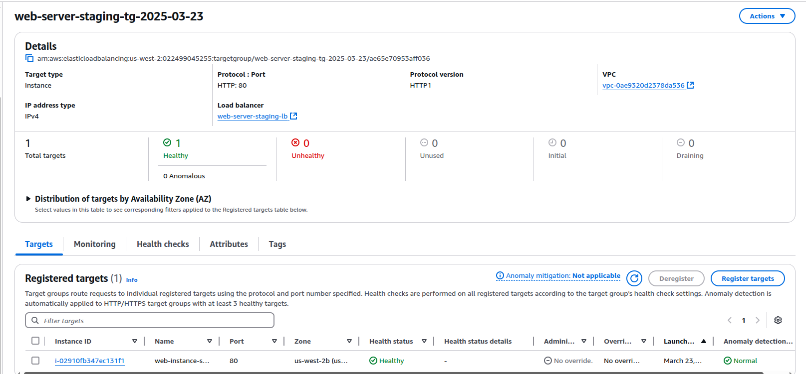
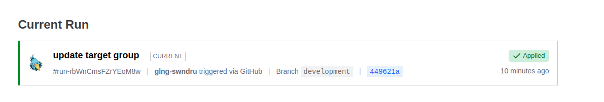
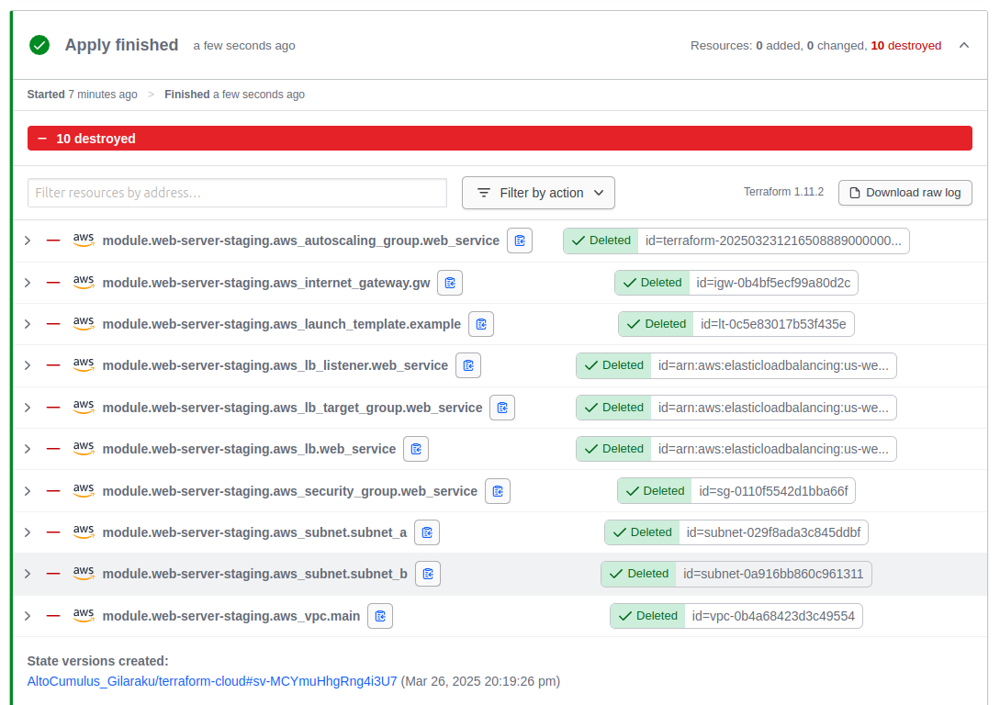

# Terraform Cloud Multi-Environment Deployment

## Overview
This project demonstrates a Terraform Cloud setup for deploying an **Auto Scaling Group (ASG) with EC2 instances**, an **Application Load Balancer (ALB)**, and supporting infrastructure on AWS. The deployment is fully automated, with changes in the `development` branch triggering a Terraform Plan and Apply in **Terraform Cloud**.

## Architecture Diagram

The diagram illustrates the **staging** and **production** environments managed by Terraform Cloud. Both environments consist of:
- **Elastic Load Balancer (ALB)** for distributing traffic.
- **Auto Scaling Group (ASG)** with EC2 instances.
- **Amazon RDS** (optional, depending on your setup).

## Features
- **Terraform Cloud Integration**: Automates deployment via GitHub repository changes.
- **Branch-Based Deployments**:
  - `development` branch → **Staging environment**.
  - `main` branch → **Production environment**.
- **AWS Auto Scaling & Load Balancing**: Ensures high availability and scalability.
- **Infrastructure as Code (IaC)**: Uses Terraform modules for better reusability and maintainability.

## Setup & Configuration
### 1. Create a Terraform Cloud Workspace
1. Go to [Terraform Cloud](https://app.terraform.io/).
2. Create a new **Workspace**.
3. Select **Version Control Workflow** and connect your GitHub repository.
4. Set **Terraform Working Directory** to `staging/ec2`.
5. Set the **VCS branch** to `development`.

### 2. Add Environment Variables
Go to the **Workspace Settings → Variables** and add the following:
| Name                | Value                 | Category   |
|---------------------|----------------------|------------|
| AWS_ACCESS_KEY_ID  | Your AWS Access Key  | Environment |
| AWS_SECRET_ACCESS_KEY | Your AWS Secret Key | Environment |

### 3. Terraform Cloud Integration
Terraform Cloud will automatically trigger **Plan** and **Apply** on every push to the `development` branch.

## Deployment Process
1. **Commit and push changes** to the `development` branch.
2. Terraform Cloud automatically runs **Terraform Plan & Apply**.
3. Staging environment is updated.
4. Once tested, merge changes to the `main` branch for **production deployment**.

## Expected Output
Once deployed, you should see:
- **EC2 Instances** running behind an **Application Load Balancer**.
- **Auto Scaling Group** managing instance scaling.
- **Security Groups** ensuring controlled network access.
- Terraform Cloud UI showing the successful deployment with logs.

## Screenshots

### 1. Terraform Cloud Variables  
*Workspace variables including AWS credentials and environment-specific settings.*  
  

### 2. EC2 Instances Running  
*List of EC2 instances launched by Terraform, managed by the Auto Scaling Group.*  
  

### 3. Application Load Balancer  
*The ALB distributing incoming traffic to EC2 instances.*  
  

### 4. Auto Scaling Configuration  
*Settings for the Auto Scaling Group, showing scaling policies and active instances.*  
  

### 5. Security Group Rules  
*Configured security groups that control network access to the instances.*  
  

### 6. Target Group  
*The target group associated with the ALB, ensuring traffic is routed to healthy instances.*  
  

### 7. Terraform Run Execution  
*Terraform Cloud logs showing the `terraform plan` and `terraform apply` process.*  
  

### 8. Terraform Destroy Execution  
*Terraform Cloud logs showing the `terraform destroy` process to remove deployed resources.*  
  

## Next Steps
- Add **monitoring and logging** (e.g., CloudWatch, Prometheus, ELK Stack).
- Implement **IAM roles and permissions** for better security.
- Extend Terraform modules for **multi-region deployments**.

---
### Repository: [GitHub - terraform-cloud](https://github.com/glng-swndru/terraform-cloud)
